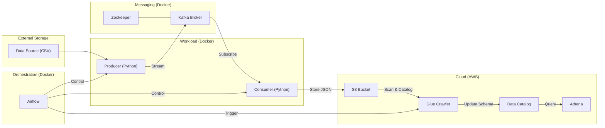

# StimulateStock Market Real-Time Data Pipeline

This project implements a real-time data pipeline for streaming and analyzing stock market data using Apache Airflow, Apache Kafka, Docker, and AWS. The pipeline simulates real-time stock updates, processes them, stores the results in an AWS S3 bucket, and uses AWS Glue Crawler and Data Catalog to make the data queryable via Amazon Athena.

## 🏗️ Architecture

The pipeline consists of the following components:

1.  **Data Source**: A CSV file containing simulated stock market data (`data/indexProcessed.csv`).
2.  **Producer**: A Python script (`producer.py`) that reads records from the CSV and sends them to a Kafka topic (simulates the streaming process).
3.  **Kafka & Zookeeper**: The message broker that handles the real-time data stream.
4.  **Consumer**: A Python script (`consumer.py`) that subscribes to the Kafka topic, processes the incoming data, and uploads it to an AWS S3 bucket.
5.  **AWS S3**: The storage for the processed real-time data.
6.  **Apache Airflow**: Orchestrates and controls the Producer, Consumer, and Glue Crawler services.
7.  **AWS Glue Crawler**: Automatically discovers the schema of data in S3 and updates the Glue Data Catalog.
8.  **AWS Glue Data Catalog**: Stores metadata about the data, making it queryable.
9.  **Amazon Athena**: SQL query service to analyze the cataloged data.



## 🚀 Getting Started

### Prerequisites

*   [Docker](https://www.docker.com/products/docker-desktop) and [Docker Compose](https://docs.docker.com/compose/install/)
*   An AWS Account with an S3 bucket.
*   AWS Credentials (Access Key & Secret Key) with S3 and Secrets Manager permissions.

### Setup Instructions

1.  **Clone the Repository**:
    ```bash
    git clone https://github.com/stevetran77/Stock-Market-Real-Time-Data-Analysis-Using-Kafka.git
    cd Stock-Market-Real-Time-Data-Analysis-Using-Kafka
    ```

2.  **Configure Environment Variables**:
    Create or update your environment variables for AWS credentials. You can set these in your shell or use a `.env` file (ensure it's not committed if you do).
    ```bash
    export AWS_ACCESS_KEY_ID=your_access_key
    export AWS_SECRET_ACCESS_KEY=your_secret_key
    ```
    Alternatively, configure a secret in AWS Secrets Manager named `s3_access_secret` containing these keys.

3.  **Launch Infrastructure**:
    Start the Kafka, Zookeeper, and Airflow services:
    ```bash
    docker-compose up -d
    ```

4.  **Initialize Workload Containers**:
    The Producer and Consumer are defined with a `workload` profile. Initialize them so Airflow can manage them:
    ```bash
    docker-compose --profile workload up --no-start
    ```
    > [!NOTE]
    > **Why `--no-start`?**
    > This command creates the container environments (network, volumes, images) but keeps them in a "Stopped" state. This is required because the Airflow DAGs (`kafka_start`/`kafka_stop`) control these containers using `docker start` and `docker stop`. Without this step, Airflow won't find the containers to trigger the data stream.

## 🛠️ Usage

### Using Airflow to Manage the Pipeline

1.  Access the Airflow Web UI at `http://localhost:8080` (Default login: `airflow`/`airflow`).
2.  **Start Data Stream**: Trigger the `kafka_start` DAG. This will:
    - Start the Producer and Consumer containers
    - Automatically trigger the Glue Crawler to catalog the data
3.  **Stop Data Stream**: Trigger the `kafka_stop` DAG. This will stop the Producer and Consumer containers.
4.  **Manual Glue Crawler**: You can also manually trigger the `glue_crawler_orchestration` DAG to run the crawler independently.

### Querying Data with Athena

Once the Glue Crawler has run successfully:

1.  Navigate to the **Amazon Athena Console**
2.  Select database: `stock_market_kafka`
3.  Run SQL queries on your cataloged tables: `kafka_stock_market_steve`


## 📝 Local Development (Non-Docker)

If you prefer to run Kafka and the scripts manually (e.g., on an EC2 instance), please refer to the detailed [Setup.md](file:///c:/Users/cau.tran/Stock-Market-Real-Time-Data-Analysis-Using-Kafka/Setup.md) for step-by-step instructions on installing Kafka, starting servers, and creating topics.

## ⚙️ Configuration

Key environment variables in `docker-compose.yml`:

### Kafka Configuration
- `KAFKA_BOOTSTRAP_SERVERS`: Kafka broker address.
- `KAFKA_TOPIC_NAME`: Name of the Kafka topic (default: `demo_testing`).

### AWS Configuration
- `S3_BUCKET_NAME`: Target S3 bucket name (default: `kafka-stock-market-steve`).
- `AWS_REGION`: AWS region (default: `ap-southeast-1`).
- `AWS_ACCESS_KEY_ID`: Your AWS access key.
- `AWS_SECRET_ACCESS_KEY`: Your AWS secret key.
- `AWS_SECRET_NAME`: Secrets Manager secret name (optional).

### Glue Configuration
Configured in `dags/glue_crawler_orchestration.py`:
- **Crawler Name**: `stock_market_kafka_project`
- **Database Name**: `stock_market_kafka`
- **IAM Role**: `glue-admin-role`

## 📚 Additional Documentation

- **[AWS_SETUP.md](file:///c:/Users/cau.tran/Stock-Market-Real-Time-Data-Analysis-Using-Kafka/doc/AWS_SETUP.md)**: Detailed guide for setting up AWS Glue Crawler, Data Catalog, and Athena
- **[TROUBLESHOOTING.md](file:///c:/Users/cau.tran/Stock-Market-Real-Time-Data-Analysis-Using-Kafka/doc/TROUBLESHOOTING.md)**: Common errors and solutions for the pipeline and Airflow
- **[No_docker_setup.md](file:///c:/Users/cau.tran/Stock-Market-Real-Time-Data-Analysis-Using-Kafka/doc/No_docker_setup.md)**: Manual setup instructions for running without Docker
