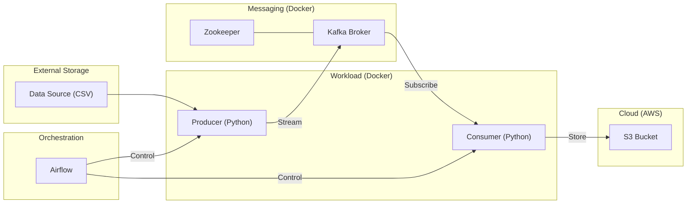

# StimulateStock Market Real-Time Data Pipeline

This project implements a real-time data pipeline for streaming and analyzing stock market data using Aphache Airflow, Apache Kafka, Docker, and AWS. The pipeline simulates real-time stock updates, processes them, and stores the results in an AWS S3 bucket. Then utilize Glue Crawler and Glue Data Catalog to get the data ready for analysis on Athena.

## 🏗️ Architecture

The pipeline consists of the following components:

1.  **Data Source**: A CSV file containing stimulations stock market data (`data/indexProcessed.csv`).
2.  **Producer**: A Python script (`producer.py`) that reads records from the CSV and sends them to a Kafka topic. (stimulate the streaming process)
3.  **Kafka & Zookeeper**: The message broker that handles the real-time data stream.
4.  **Consumer**: A Python script (`consumer.py`) that subscribes to the Kafka topic, processes the incoming data, and uploads it to an AWS S3 bucket.
5.  **AWS S3**: The final storage for the processed real-time data.
6.  **Apache Airflow**: Used to orchestrate and control the starting and stopping of the Producer and Consumer services.



## 🚀 Getting Started

### Prerequisites

*   [Docker](https://www.docker.com/products/docker-desktop) and [Docker Compose](https://docs.docker.com/compose/install/)
*   An AWS Account with an S3 bucket.
*   AWS Credentials (Access Key & Secret Key) with S3 and Secrets Manager permissions.

### Setup Instructions

1.  **Clone the Repository**:
    ```bash
    git clone https://github.com/stevetran77/Stock-Market-Real-Time-Data-Analysis-Using-Kafka.git
    cd Stock-Market-Real-Time-Data-Analysis-Using-Kafka
    ```

2.  **Configure Environment Variables**:
    Create or update your environment variables for AWS credentials. You can set these in your shell or use a `.env` file (ensure it's not committed if you do).
    ```bash
    export AWS_ACCESS_KEY_ID=your_access_key
    export AWS_SECRET_ACCESS_KEY=your_secret_key
    ```
    Alternatively, configure a secret in AWS Secrets Manager named `s3_access_secret` containing these keys.

3.  **Launch Infrastructure**:
    Start the Kafka, Zookeeper, and Airflow services:
    ```bash
    docker-compose up -d
    ```

4.  **Initialize Workload Containers**:
    The Producer and Consumer are defined with a `workload` profile. Initialize them so Airflow can manage them:
    ```bash
    docker-compose --profile workload up --no-start
    ```

## 🛠️ Usage

### Using Airflow to Manage the Pipeline

1.  Access the Airflow Web UI at `http://localhost:8080` (Default login: `airflow`/`airflow`).
2.  **Start Data Stream**: Trigger the `kafka_start` DAG. This will start the Producer and Consumer containers.
3.  **Stop Data Stream**: Trigger the `kafka_stop` DAG. This will stop the containers.

### Monitoring

*   **Producer Logs**: `docker logs -f <producer_container_id>`
*   **Consumer Logs**: `docker logs -f <consumer_container_id>`
*   **S3 Verification**: Check your S3 bucket (`kafka-stock-market-steve` or as configured) to see the incoming `.json` files.

## 📝 Local Development (Non-Docker)

If you prefer to run Kafka and the scripts manually (e.g., on an EC2 instance), please refer to the detailed [Setup.md](file:///c:/Users/cau.tran/Stock-Market-Real-Time-Data-Analysis-Using-Kafka/Setup.md) for step-by-step instructions on installing Kafka, starting servers, and creating topics.

## ⚙️ Configuration

Key environment variables in `docker-compose.yml`:
- `KAFKA_BOOTSTRAP_SERVERS`: Kafka broker address.
- `KAFKA_TOPIC_NAME`: Name of the Kafka topic (default: `demo_testing`).
- `S3_BUCKET_NAME`: Target S3 bucket name.
- `AWS_REGION`: AWS region for S3 and Secrets Manager.
